# Healdi v1.2 - Component Architecture Diagrams

This document provides visual representations of the Healdi template's architecture using Mermaid diagrams.

## Table of Contents
1. [Page Structure Flow](#page-structure-flow)
2. [Component Hierarchy](#component-hierarchy)
3. [JavaScript Initialization Flow](#javascript-initialization-flow)
4. [Form Submission Flow](#form-submission-flow)
5. [Responsive Breakpoint System](#responsive-breakpoint-system)
6. [Animation Trigger System](#animation-trigger-system)
7. [Component Interaction Map](#component-interaction-map)
8. [Data Flow: Form to Email](#data-flow-form-to-email)
9. [Carousel Configuration Pattern](#carousel-configuration-pattern)
10. [Mobile Navigation Flow](#mobile-navigation-flow)
11. [CSS Class Naming Pattern](#css-class-naming-pattern)
12. [Animation Timing System](#animation-timing-system)
13. [Icon System Architecture](#icon-system-architecture)
14. [File Loading Order](#file-loading-order)

---

## Page Structure Flow

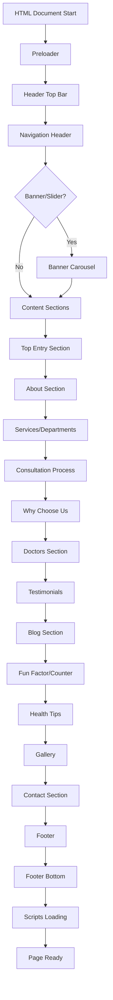

---

## Component Hierarchy

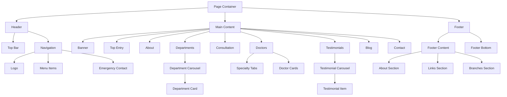

---

## JavaScript Initialization Flow

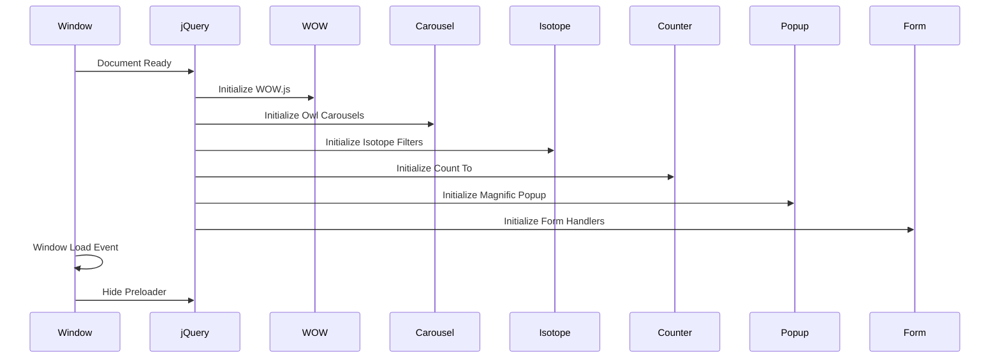

---

## Form Submission Flow

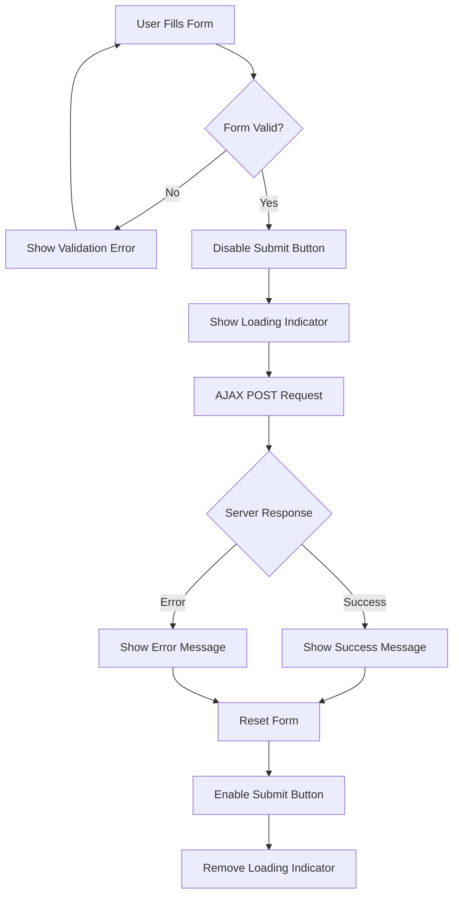

---

## Responsive Breakpoint System

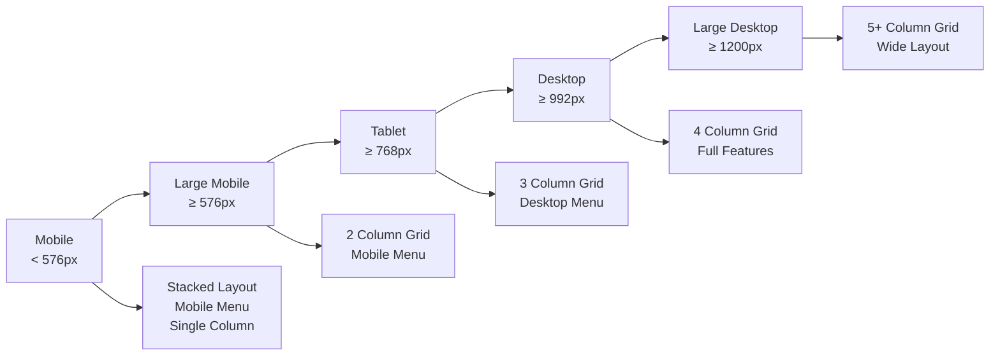

---

## Animation Trigger System

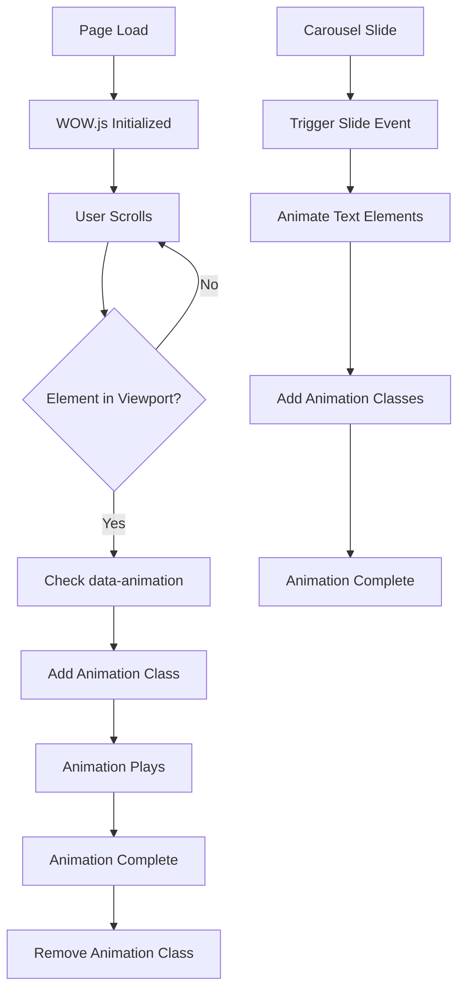

---

## Component Interaction Map

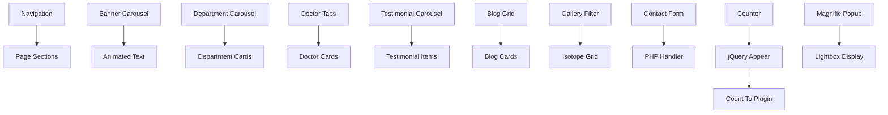

---

## Data Flow: Form to Email

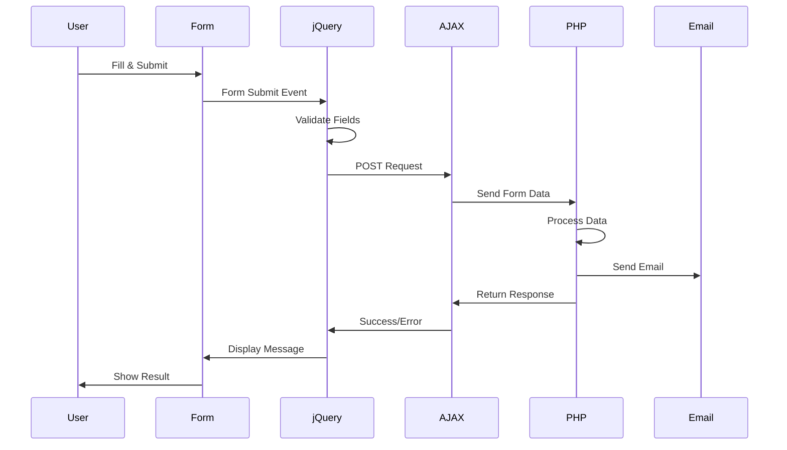

---

## Carousel Configuration Pattern

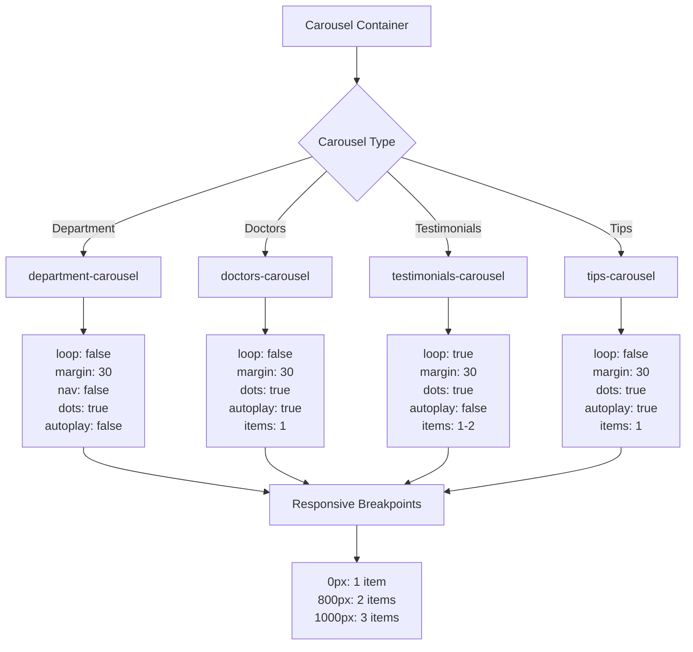

---

## Mobile Navigation Flow

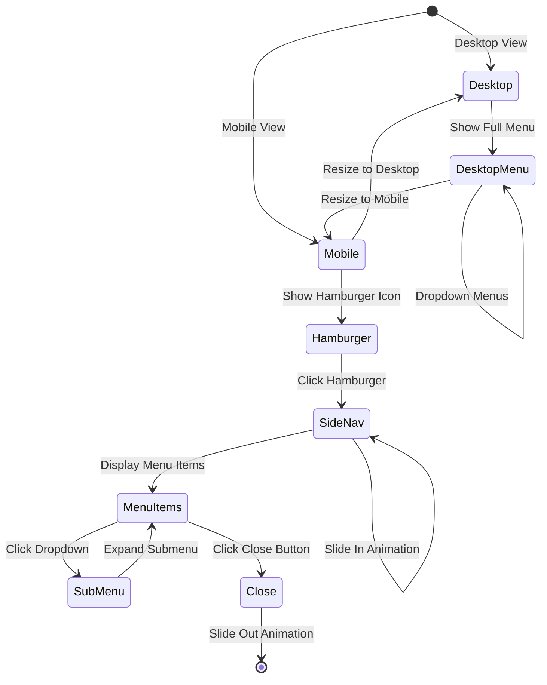

---

## CSS Class Naming Pattern

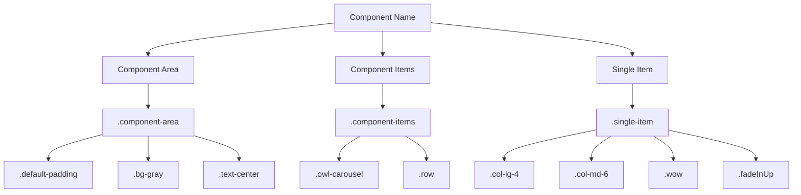

---

## Animation Timing System

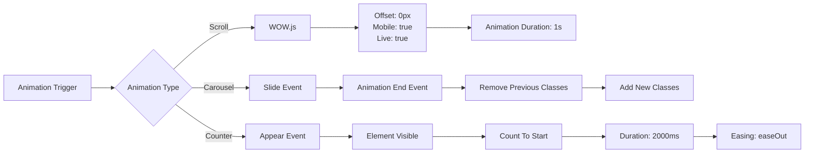

---

## Icon System Architecture

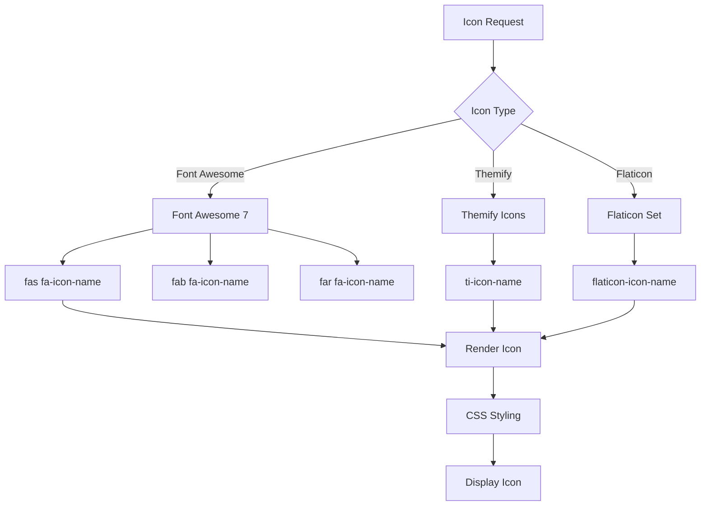

---

## File Loading Order

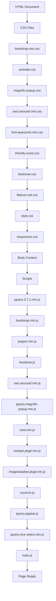

---

## Component State Transitions

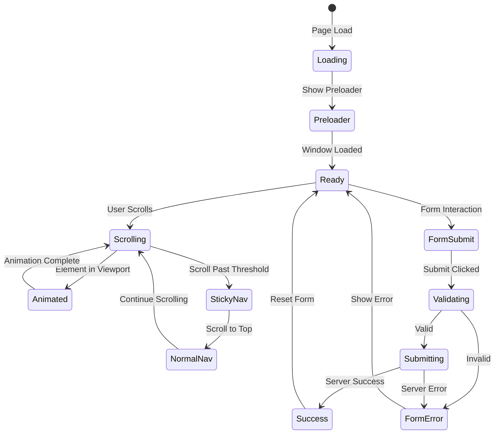

---

*These diagrams provide a visual representation of the Healdi v1.2 template's architecture and component relationships. Use them as a reference when customizing or extending the template.*
