# Flow Diagrams Documentation

**Date**: January 29, 2026  
**Version**: 2.0  
**Status**: Production Ready

---

## Table of Contents

1. [System Overview Flow](#system-overview-flow)
2. [Approval Workflows](#approval-workflows)
3. [User Authentication Flow](#user-authentication-flow)
4. [Referral Flow](#referral-flow)
5. [Messaging Flow](#messaging-flow)
6. [Practice Management Flow](#practice-management-flow)

---

## System Overview Flow

### High-Level System Architecture

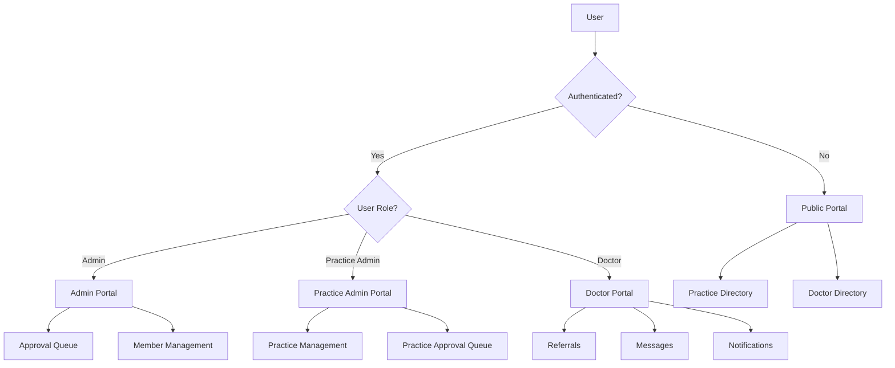
```mermaid
graph TB
    A[User] --> B{Authenticated?}
    B -->|No| C[Public Portal]
    B -->|Yes| D{User Role?}
    
    D -->|Admin| E[Admin Portal]
    D -->|Practice Admin| F[Practice Admin Portal]
    D -->|Doctor| G[Doctor Portal]
    
    C --> H[Practice Directory]
    C --> I[Doctor Directory]
    
    E --> J[Approval Queue]
    E --> K[Member Management]
    
    F --> L[Practice Management]
    F --> M[Practice Approval Queue]
    
    G --> N[Referrals]
    G --> O[Messages]
    G --> P[Notifications]
```

---

## Approval Workflows

### Workflow 1: Doctor Joins Existing Practice

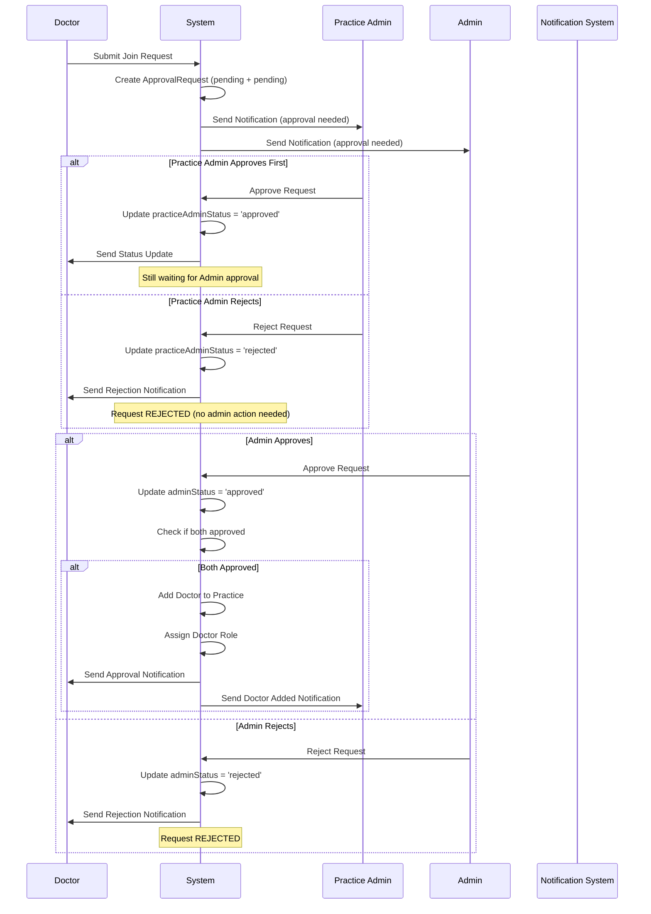
```mermaid
sequenceDiagram
    participant D as Doctor
    participant S as System
    participant PA as Practice Admin
    participant A as Admin
    participant N as Notification System
    
    D->>S: Submit Join Request
    S->>S: Create ApprovalRequest (pending + pending)
    S->>PA: Send Notification (approval needed)
    S->>A: Send Notification (approval needed)
    
    alt Practice Admin Approves First
        PA->>S: Approve Request
        S->>S: Update practiceAdminStatus = 'approved'
        S->>D: Send Status Update
        Note over S: Still waiting for Admin approval
    else Practice Admin Rejects
        PA->>S: Reject Request
        S->>S: Update practiceAdminStatus = 'rejected'
        S->>D: Send Rejection Notification
        Note over S: Request REJECTED (no admin action needed)
    end
    
    alt Admin Approves
        A->>S: Approve Request
        S->>S: Update adminStatus = 'approved'
        S->>S: Check if both approved
        alt Both Approved
            S->>S: Add Doctor to Practice
            S->>S: Assign Doctor Role
            S->>D: Send Approval Notification
            S->>PA: Send Doctor Added Notification
        end
    else Admin Rejects
        A->>S: Reject Request
        S->>S: Update adminStatus = 'rejected'
        S->>D: Send Rejection Notification
        Note over S: Request REJECTED
    end
```

**Function References**:
- `submitApprovalRequest()` - `src/lib/services/approvalEngine.ts:304`
- `decideAsPracticeAdmin()` - `src/lib/services/approvalEngine.ts:580`
- `decideAsAdmin()` - `src/lib/services/approvalEngine.ts:470`

---

### Workflow 2: Practice Creation

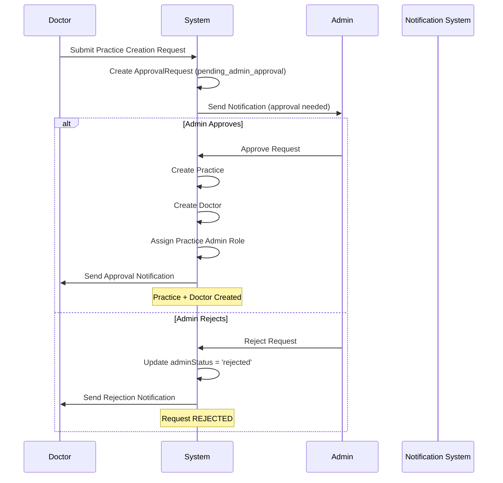
```mermaid
sequenceDiagram
    participant D as Doctor
    participant S as System
    participant A as Admin
    participant N as Notification System
    
    D->>S: Submit Practice Creation Request
    S->>S: Create ApprovalRequest (pending_admin_approval)
    S->>A: Send Notification (approval needed)
    
    alt Admin Approves
        A->>S: Approve Request
        S->>S: Create Practice
        S->>S: Create Doctor
        S->>S: Assign Practice Admin Role
        S->>D: Send Approval Notification
        Note over S: Practice + Doctor Created
    else Admin Rejects
        A->>S: Reject Request
        S->>S: Update adminStatus = 'rejected'
        S->>D: Send Rejection Notification
        Note over S: Request REJECTED
    end
```

**Function References**:
- `submitApprovalRequest()` - `src/lib/services/approvalEngine.ts:304`
- `decideAsAdmin()` - `src/lib/services/approvalEngine.ts:470`
- `addCreatedPractice()` - `src/lib/storage/practiceStorage.ts`
- `saveDoctorOverride()` - `src/lib/memberStorage.ts`

---

### Workflow 3: Practice Edit Request

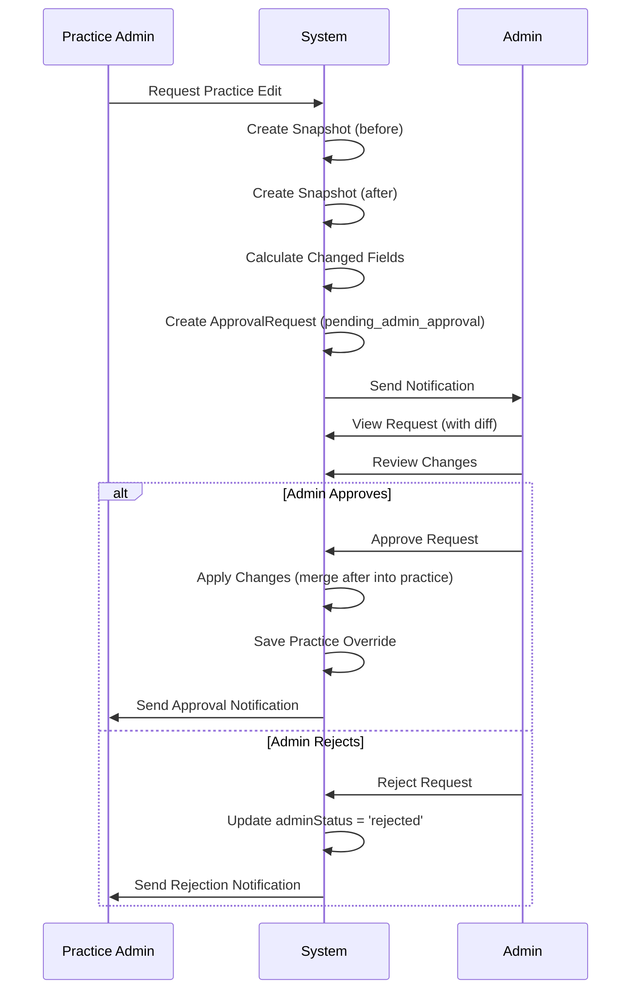
```mermaid
sequenceDiagram
    participant PA as Practice Admin
    participant S as System
    participant A as Admin
    
    PA->>S: Request Practice Edit
    S->>S: Create Snapshot (before)
    S->>S: Create Snapshot (after)
    S->>S: Calculate Changed Fields
    S->>S: Create ApprovalRequest (pending_admin_approval)
    S->>A: Send Notification
    
    A->>S: View Request (with diff)
    A->>S: Review Changes
    
    alt Admin Approves
        A->>S: Approve Request
        S->>S: Apply Changes (merge after into practice)
        S->>S: Save Practice Override
        S->>PA: Send Approval Notification
    else Admin Rejects
        A->>S: Reject Request
        S->>S: Update adminStatus = 'rejected'
        S->>PA: Send Rejection Notification
    end
```

**Function References**:
- `submitApprovalRequest()` - `src/lib/services/approvalEngine.ts:304`
- `decideAsAdmin()` - `src/lib/services/approvalEngine.ts:470`
- `savePracticeOverride()` - `src/lib/storage/practiceStorage.ts`
- `PracticeSummary` - `src/components/shared/approvals/PracticeSummary.tsx`
- `ChangedFieldsList` - `src/components/shared/approvals/ChangedFieldsList.tsx`

---

### Workflow 4: Location Management (Add)

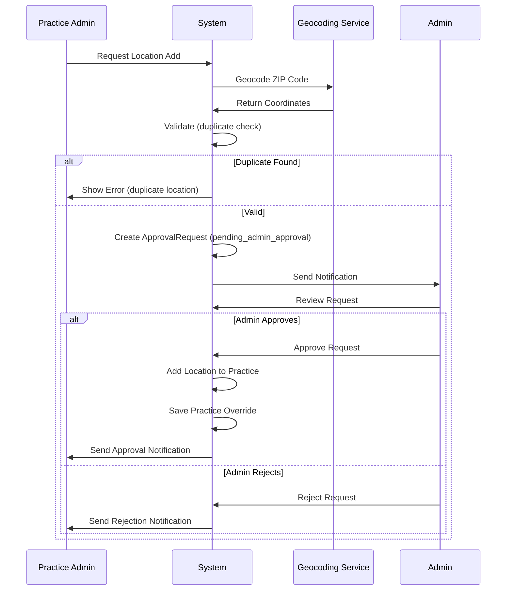
```mermaid
sequenceDiagram
    participant PA as Practice Admin
    participant S as System
    participant G as Geocoding Service
    participant A as Admin
    
    PA->>S: Request Location Add
    S->>G: Geocode ZIP Code
    G->>S: Return Coordinates
    S->>S: Validate (duplicate check)
    
    alt Duplicate Found
        S->>PA: Show Error (duplicate location)
    else Valid
        S->>S: Create ApprovalRequest (pending_admin_approval)
        S->>A: Send Notification
        
        A->>S: Review Request
        alt Admin Approves
            A->>S: Approve Request
            S->>S: Add Location to Practice
            S->>S: Save Practice Override
            S->>PA: Send Approval Notification
        else Admin Rejects
            A->>S: Reject Request
            S->>PA: Send Rejection Notification
        end
    end
```

**Function References**:
- `submitApprovalRequest()` - `src/lib/services/approvalEngine.ts:304`
- `validateLocationApprovalRequest()` - `src/lib/services/approvalEngine.ts:318`
- `geocodeZip()` - `src/lib/services/geocodingService.ts:9`
- `decideAsAdmin()` - `src/lib/services/approvalEngine.ts:470`

---

### Workflow 5: Roster Management (Add Doctor)

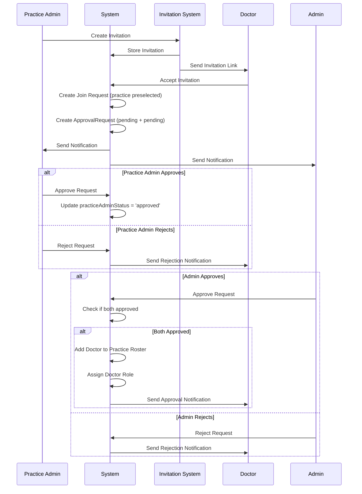
```mermaid
sequenceDiagram
    participant PA as Practice Admin
    participant S as System
    participant I as Invitation System
    participant D as Doctor
    participant A as Admin
    
    PA->>I: Create Invitation
    I->>S: Store Invitation
    I->>D: Send Invitation Link
    
    D->>S: Accept Invitation
    S->>S: Create Join Request (practice preselected)
    S->>S: Create ApprovalRequest (pending + pending)
    S->>PA: Send Notification
    S->>A: Send Notification
    
    alt Practice Admin Approves
        PA->>S: Approve Request
        S->>S: Update practiceAdminStatus = 'approved'
    else Practice Admin Rejects
        PA->>S: Reject Request
        S->>D: Send Rejection Notification
    end
    
    alt Admin Approves
        A->>S: Approve Request
        S->>S: Check if both approved
        alt Both Approved
            S->>S: Add Doctor to Practice Roster
            S->>S: Assign Doctor Role
            S->>D: Send Approval Notification
        end
    else Admin Rejects
        A->>S: Reject Request
        S->>D: Send Rejection Notification
    end
```

**Function References**:
- `createInvitation()` - `src/lib/storage/invitationStorage.ts`
- `submitApprovalRequest()` - `src/lib/services/approvalEngine.ts:304`
- `validateRosterPayload()` - `src/lib/services/approvalEngine.ts:327`
- `decideAsPracticeAdmin()` - `src/lib/services/approvalEngine.ts:580`
- `decideAsAdmin()` - `src/lib/services/approvalEngine.ts:470`

---

## User Authentication Flow

### Authentication and Role Resolution

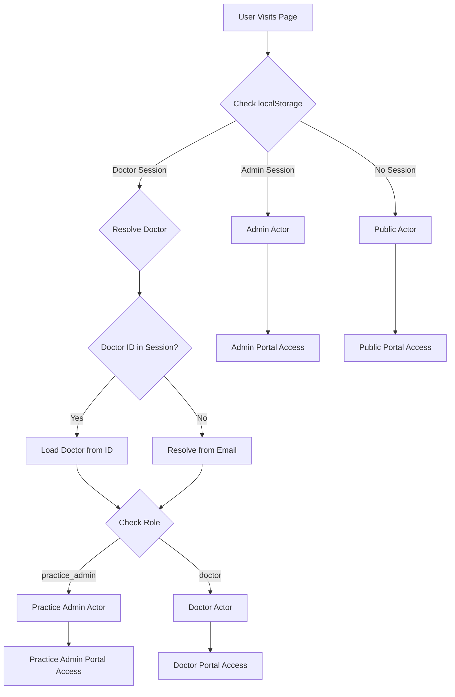
```mermaid
graph TB
    A[User Visits Page] --> B{Check localStorage}
    B -->|Admin Session| C[Admin Actor]
    B -->|Doctor Session| D{Resolve Doctor}
    B -->|No Session| E[Public Actor]
    
    D --> F{Doctor ID in Session?}
    F -->|Yes| G[Load Doctor from ID]
    F -->|No| H[Resolve from Email]
    
    G --> I{Check Role}
    H --> I
    
    I -->|practice_admin| J[Practice Admin Actor]
    I -->|doctor| K[Doctor Actor]
    
    C --> L[Admin Portal Access]
    J --> M[Practice Admin Portal Access]
    K --> N[Doctor Portal Access]
    E --> O[Public Portal Access]
```

**Function References**:
- `getActorFromSession()` - `src/lib/services/permissionService.ts:32`
- `getAdminSession()` - `src/lib/adminSession.ts`
- `useDoctorSession()` - `src/lib/useDoctorSession.ts`

---

### Login Flow

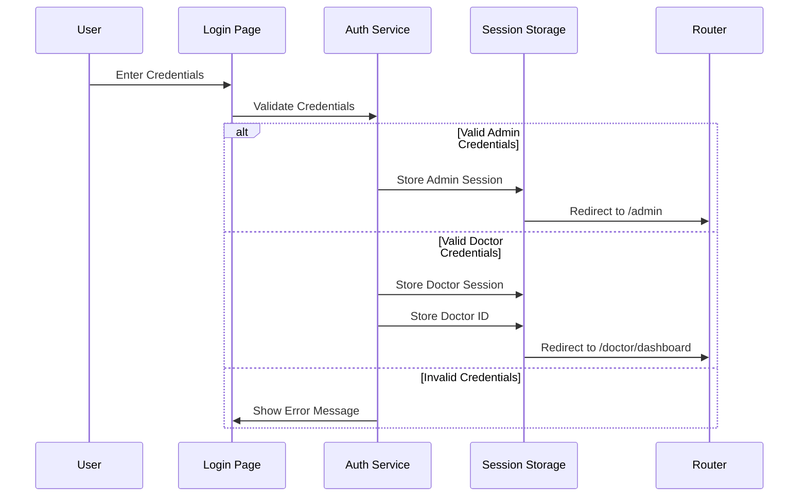
```mermaid
sequenceDiagram
    participant U as User
    participant L as Login Page
    participant A as Auth Service
    participant S as Session Storage
    participant R as Router
    
    U->>L: Enter Credentials
    L->>A: Validate Credentials
    
    alt Valid Admin Credentials
        A->>S: Store Admin Session
        S->>R: Redirect to /admin
    else Valid Doctor Credentials
        A->>S: Store Doctor Session
        A->>S: Store Doctor ID
        S->>R: Redirect to /doctor/dashboard
    else Invalid Credentials
        A->>L: Show Error Message
    end
```

**Function References**:
- `setAdminSession()` - `src/lib/adminSession.ts`
- `setSession()` - `src/lib/useDoctorSession.ts`

---

## Referral Flow

### Referral Creation and Status Updates

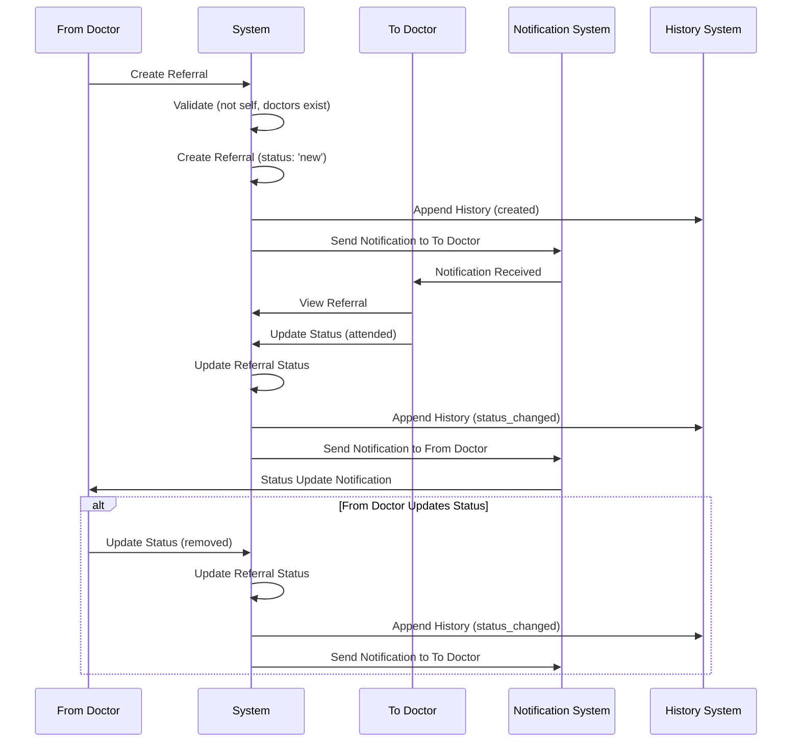
```mermaid
sequenceDiagram
    participant FD as From Doctor
    participant S as System
    participant TD as To Doctor
    participant N as Notification System
    participant H as History System
    
    FD->>S: Create Referral
    S->>S: Validate (not self, doctors exist)
    S->>S: Create Referral (status: 'new')
    S->>H: Append History (created)
    S->>N: Send Notification to To Doctor
    N->>TD: Notification Received
    
    TD->>S: View Referral
    TD->>S: Update Status (attended)
    S->>S: Update Referral Status
    S->>H: Append History (status_changed)
    S->>N: Send Notification to From Doctor
    N->>FD: Status Update Notification
    
    alt From Doctor Updates Status
        FD->>S: Update Status (removed)
        S->>S: Update Referral Status
        S->>H: Append History (status_changed)
        S->>N: Send Notification to To Doctor
    end
```

**Function References**:
- `createReferral()` - `src/lib/services/referralEngine.ts:83`
- `updateReferralStatus()` - `src/lib/services/referralEngine.ts:165`
- `appendReferralHistoryRecord()` - `src/lib/services/referralEngine.ts:48`
- `addNotification()` - `src/lib/storage/notificationStorage.ts`

---

## Messaging Flow

### Message Sending and Receiving

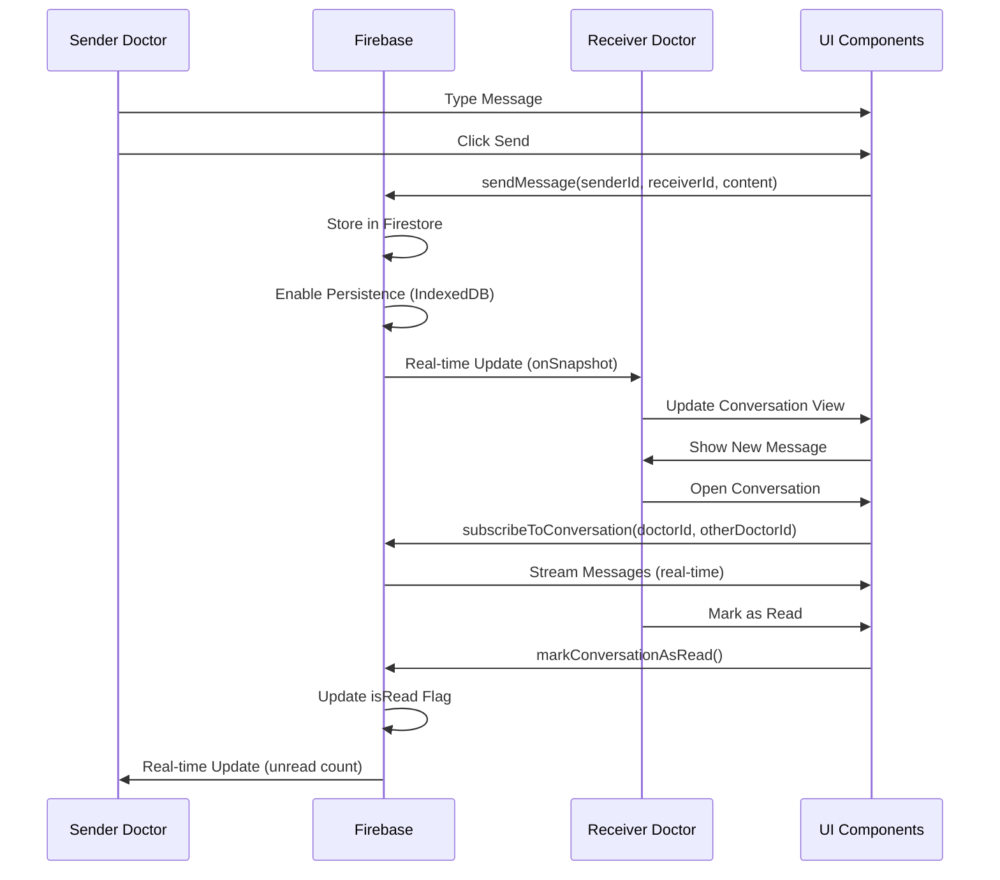
```mermaid
sequenceDiagram
    participant SD as Sender Doctor
    participant F as Firebase
    participant RD as Receiver Doctor
    participant UI as UI Components
    
    SD->>UI: Type Message
    SD->>UI: Click Send
    UI->>F: sendMessage(senderId, receiverId, content)
    F->>F: Store in Firestore
    F->>F: Enable Persistence (IndexedDB)
    
    F->>RD: Real-time Update (onSnapshot)
    RD->>UI: Update Conversation View
    UI->>RD: Show New Message
    
    RD->>UI: Open Conversation
    UI->>F: subscribeToConversation(doctorId, otherDoctorId)
    F->>UI: Stream Messages (real-time)
    
    RD->>UI: Mark as Read
    UI->>F: markConversationAsRead()
    F->>F: Update isRead Flag
    F->>SD: Real-time Update (unread count)
```

**Function References**:
- `sendMessage()` - `src/lib/messageStorage.ts:20`
- `subscribeToConversation()` - `src/lib/messageStorage.ts:76`
- `markConversationAsRead()` - `src/lib/messageStorage.ts:147`
- `subscribeToConversationPartners()` - `src/lib/messageStorage.ts:143`

---

## Practice Management Flow

### Practice Admin Managing Practice

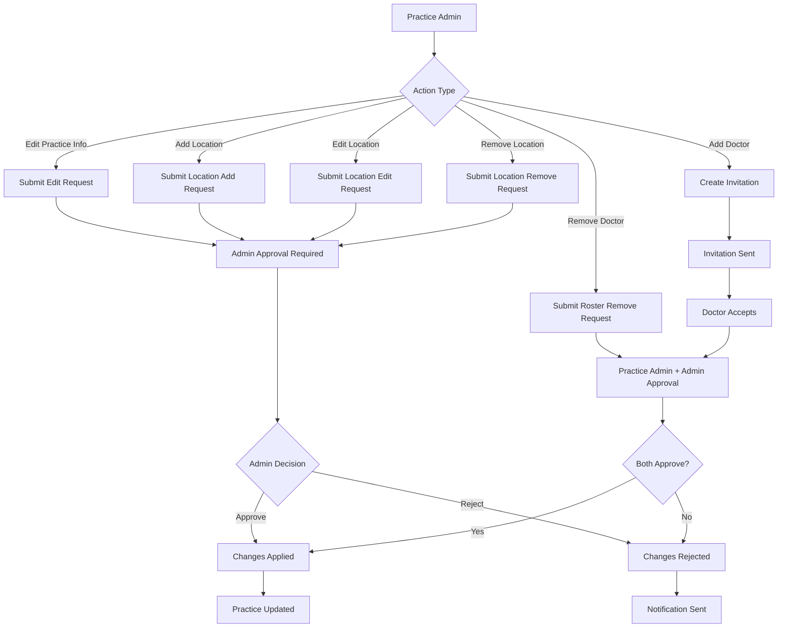
```mermaid
graph TB
    A[Practice Admin] --> B{Action Type}
    
    B -->|Edit Practice Info| C[Submit Edit Request]
    B -->|Add Location| D[Submit Location Add Request]
    B -->|Edit Location| E[Submit Location Edit Request]
    B -->|Remove Location| F[Submit Location Remove Request]
    B -->|Add Doctor| G[Create Invitation]
    B -->|Remove Doctor| H[Submit Roster Remove Request]
    
    C --> I[Admin Approval Required]
    D --> I
    E --> I
    F --> I
    G --> J[Invitation Sent]
    H --> K[Practice Admin + Admin Approval]
    
    J --> L[Doctor Accepts]
    L --> K
    
    I --> M{Admin Decision}
    K --> N{Both Approve?}
    
    M -->|Approve| O[Changes Applied]
    M -->|Reject| P[Changes Rejected]
    
    N -->|Yes| O
    N -->|No| P
    
    O --> Q[Practice Updated]
    P --> R[Notification Sent]
```

**Function References**:
- `submitApprovalRequest()` - `src/lib/services/approvalEngine.ts:304`
- `decideAsAdmin()` - `src/lib/services/approvalEngine.ts:470`
- `decideAsPracticeAdmin()` - `src/lib/services/approvalEngine.ts:580`
- `createInvitation()` - `src/lib/storage/invitationStorage.ts`

---

### Practice Directory Flow

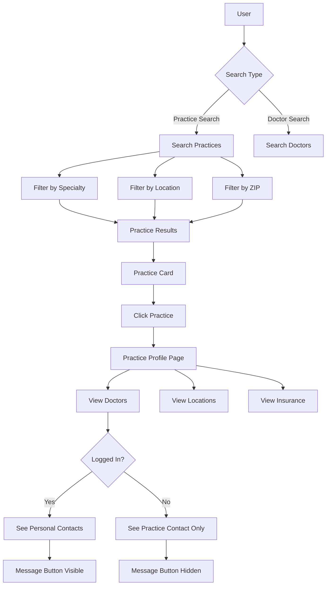
```mermaid
graph TB
    A[User] --> B{Search Type}
    
    B -->|Practice Search| C[Search Practices]
    B -->|Doctor Search| D[Search Doctors]
    
    C --> E[Filter by Specialty]
    C --> F[Filter by Location]
    C --> G[Filter by ZIP]
    
    E --> H[Practice Results]
    F --> H
    G --> H
    
    H --> I[Practice Card]
    I --> J[Click Practice]
    J --> K[Practice Profile Page]
    
    K --> L[View Doctors]
    K --> M[View Locations]
    K --> N[View Insurance]
    
    L --> O{Logged In?}
    O -->|Yes| P[See Personal Contacts]
    O -->|No| Q[See Practice Contact Only]
    
    P --> R[Message Button Visible]
    Q --> S[Message Button Hidden]
```

**Function References**:
- `getPracticeById()` - `src/lib/services/practiceDirectoryService.ts:106`
- `getContactCard()` - `src/lib/services/visibilityService.ts:44`
- `canViewDoctorPrivateContact()` - `src/lib/services/permissionService.ts:157`

---

## Contact Visibility Flow

### Contact Display Logic

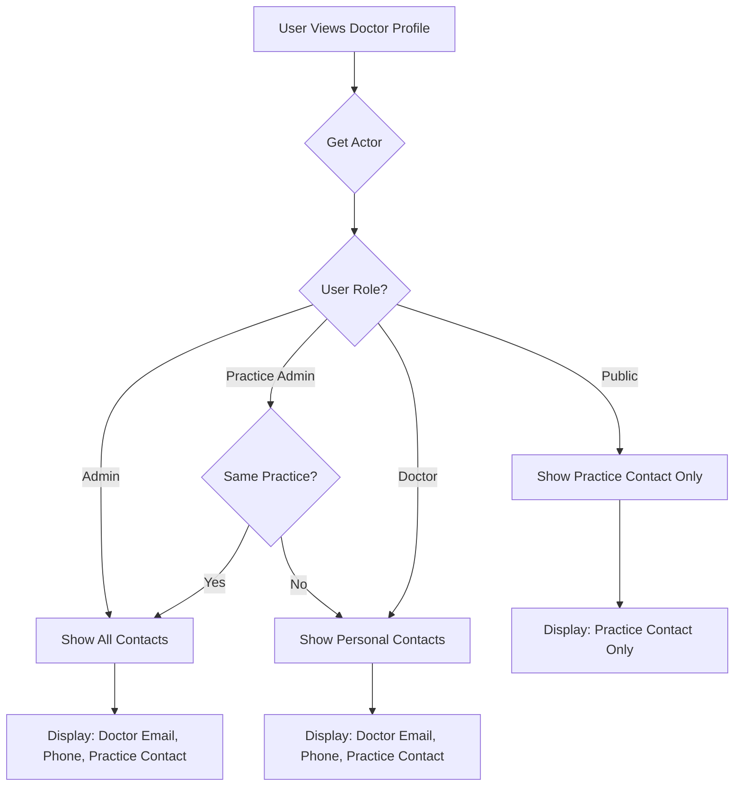
```mermaid
graph TB
    A[User Views Doctor Profile] --> B{Get Actor}
    
    B --> C{User Role?}
    
    C -->|Admin| D[Show All Contacts]
    C -->|Practice Admin| E{Same Practice?}
    C -->|Doctor| F[Show Personal Contacts]
    C -->|Public| G[Show Practice Contact Only]
    
    E -->|Yes| D
    E -->|No| F
    
    D --> H[Display: Doctor Email, Phone, Practice Contact]
    F --> I[Display: Doctor Email, Phone, Practice Contact]
    G --> J[Display: Practice Contact Only]
```

**Function References**:
- `getActorFromSession()` - `src/lib/services/permissionService.ts:32`
- `getContactCard()` - `src/lib/services/visibilityService.ts:44`
- `canViewDoctorPrivateContact()` - `src/lib/services/permissionService.ts:157`
- `getDoctorPublicContact()` - `src/lib/services/visibilityService.ts:44`

---

## Notification Flow

### Notification Creation and Delivery

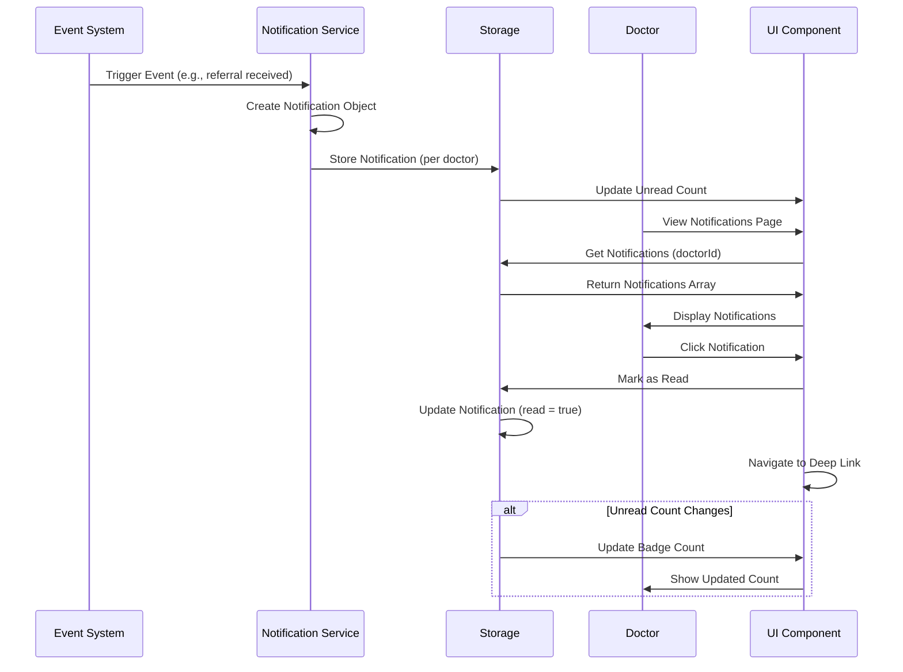
```mermaid
sequenceDiagram
    participant E as Event System
    participant N as Notification Service
    participant S as Storage
    participant D as Doctor
    participant UI as UI Component
    
    E->>N: Trigger Event (e.g., referral received)
    N->>N: Create Notification Object
    N->>S: Store Notification (per doctor)
    S->>UI: Update Unread Count
    
    D->>UI: View Notifications Page
    UI->>S: Get Notifications (doctorId)
    S->>UI: Return Notifications Array
    UI->>D: Display Notifications
    
    D->>UI: Click Notification
    UI->>S: Mark as Read
    S->>S: Update Notification (read = true)
    UI->>UI: Navigate to Deep Link
    
    alt Unread Count Changes
        S->>UI: Update Badge Count
        UI->>D: Show Updated Count
    end
```

**Function References**:
- `addNotification()` - `src/lib/storage/notificationStorage.ts`
- `getNotifications()` - `src/lib/storage/notificationStorage.ts`
- `markNotificationRead()` - `src/lib/storage/notificationStorage.ts`
- `getUnreadCount()` - `src/lib/storage/notificationStorage.ts`

---

## Data Flow: Approval Request Lifecycle

### Complete Approval Request Lifecycle

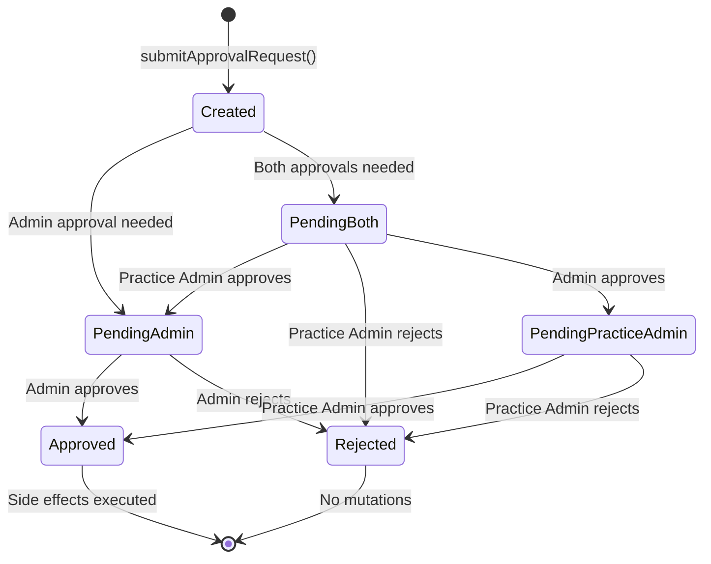
```mermaid
stateDiagram-v2
    [*] --> Created: submitApprovalRequest()
    
    Created --> PendingAdmin: Admin approval needed
    Created --> PendingBoth: Both approvals needed
    
    PendingBoth --> PendingAdmin: Practice Admin approves
    PendingBoth --> Rejected: Practice Admin rejects
    PendingBoth --> PendingPracticeAdmin: Admin approves
    
    PendingAdmin --> Approved: Admin approves
    PendingAdmin --> Rejected: Admin rejects
    
    PendingPracticeAdmin --> Approved: Practice Admin approves
    PendingPracticeAdmin --> Rejected: Practice Admin rejects
    
    Approved --> [*]: Side effects executed
    Rejected --> [*]: No mutations
```

**Function References**:
- `submitApprovalRequest()` - `src/lib/services/approvalEngine.ts:304`
- `decideAsAdmin()` - `src/lib/services/approvalEngine.ts:470`
- `decideAsPracticeAdmin()` - `src/lib/services/approvalEngine.ts:580`

---

## Error Handling Flow

### Error Handling in Approval System

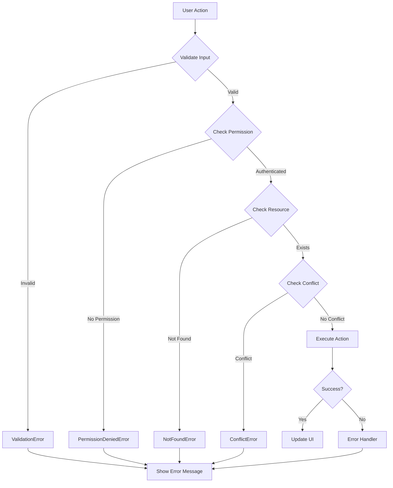
```mermaid
graph TB
    A[User Action] --> B{Validate Input}
    
    B -->|Invalid| C[ValidationError]
    B -->|Valid| D{Check Permission}
    
    D -->|No Permission| E[PermissionDeniedError]
    D -->|Authenticated| F{Check Resource}
    
    F -->|Not Found| G[NotFoundError]
    F -->|Exists| H{Check Conflict}
    
    H -->|Conflict| I[ConflictError]
    H -->|No Conflict| J[Execute Action]
    
    C --> K[Show Error Message]
    E --> K
    G --> K
    I --> K
    
    J --> L{Success?}
    L -->|Yes| M[Update UI]
    L -->|No| N[Error Handler]
    N --> K
```

**Function References**:
- `ValidationError` - `src/lib/services/errors.ts`
- `PermissionDeniedError` - `src/lib/services/errors.ts`
- `NotFoundError` - `src/lib/services/errors.ts`
- `ConflictError` - `src/lib/services/errors.ts`

---

## Storage Flow

### localStorage Data Flow

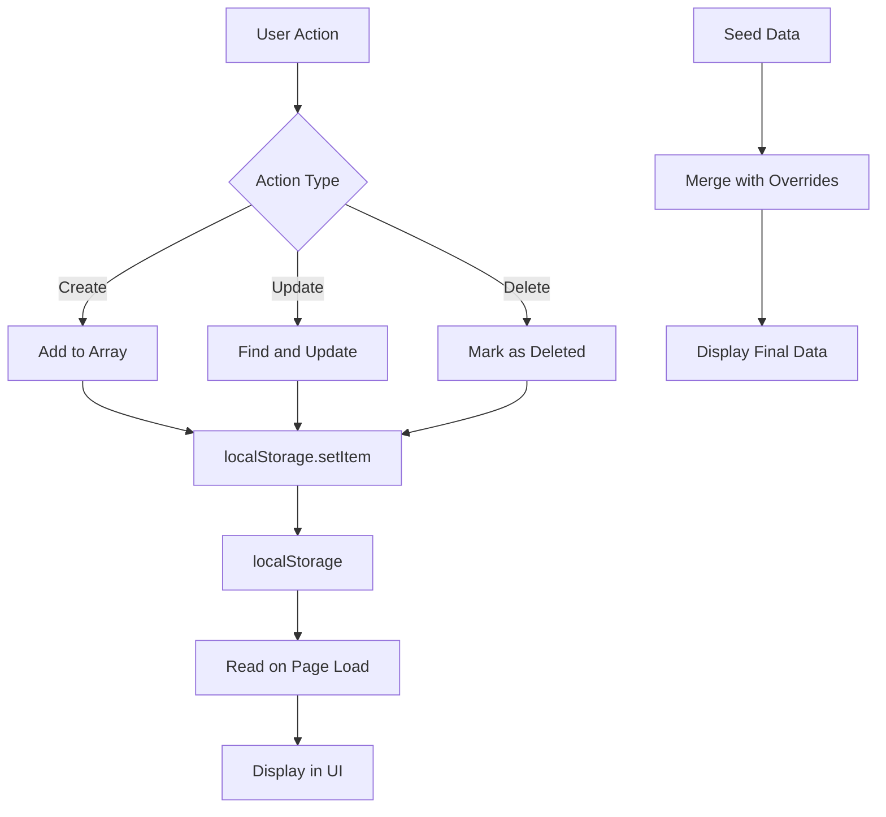
```mermaid
graph TB
    A[User Action] --> B{Action Type}
    
    B -->|Create| C[Add to Array]
    B -->|Update| D[Find and Update]
    B -->|Delete| E[Mark as Deleted]
    
    C --> F[localStorage.setItem]
    D --> F
    E --> F
    
    F --> G[localStorage]
    G --> H[Read on Page Load]
    H --> I[Display in UI]
    
    J[Seed Data] --> K[Merge with Overrides]
    K --> L[Display Final Data]
```

**Storage Keys**:
- `aip_approval_requests` - Approval requests
- `aip_referrals` - Referrals
- `aip_notifications_{doctorId}` - Notifications
- `aip_practice_overrides` - Practice modifications
- `aip_doctor_overrides` - Doctor modifications

---

**Last Updated**: January 29, 2026  
**Documentation Version**: 1.0
