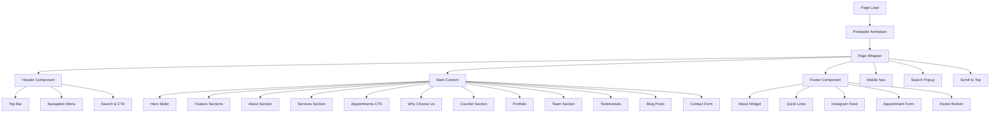
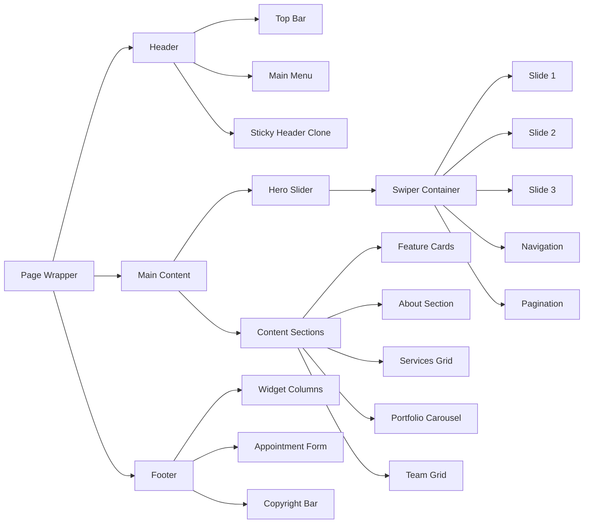
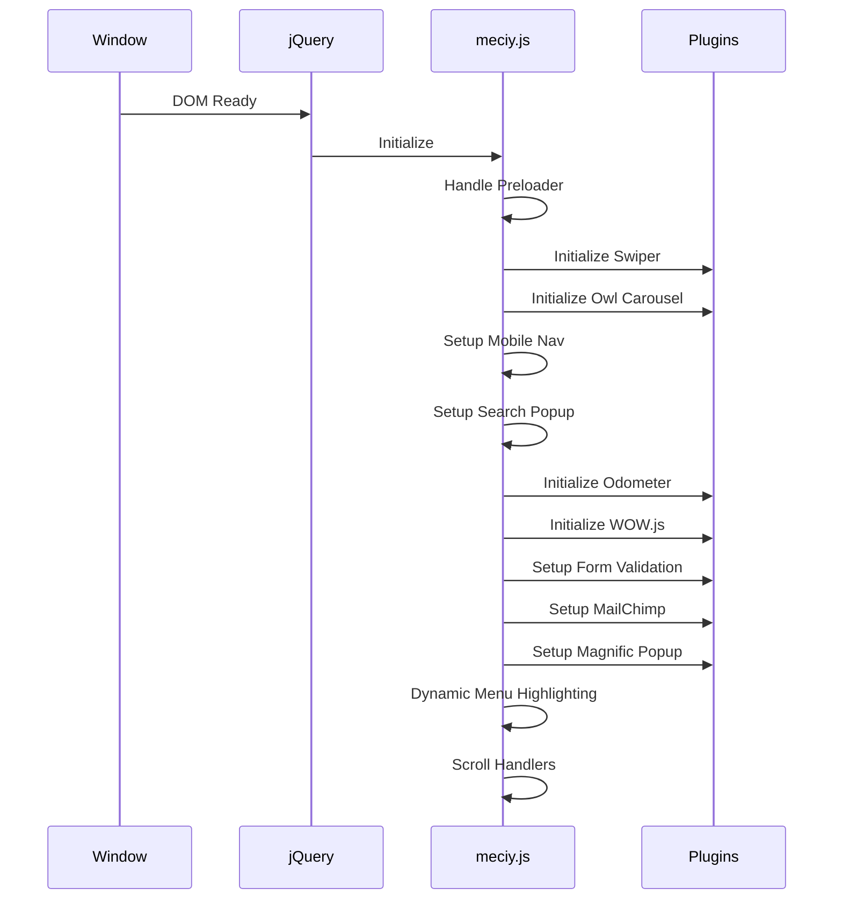
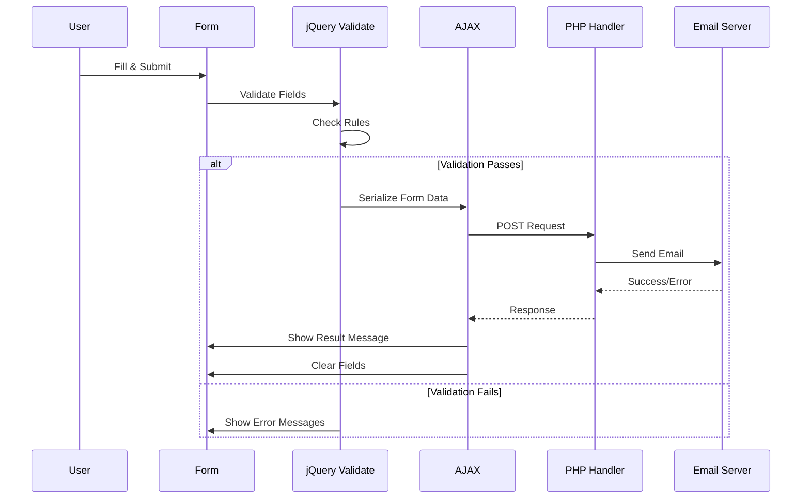
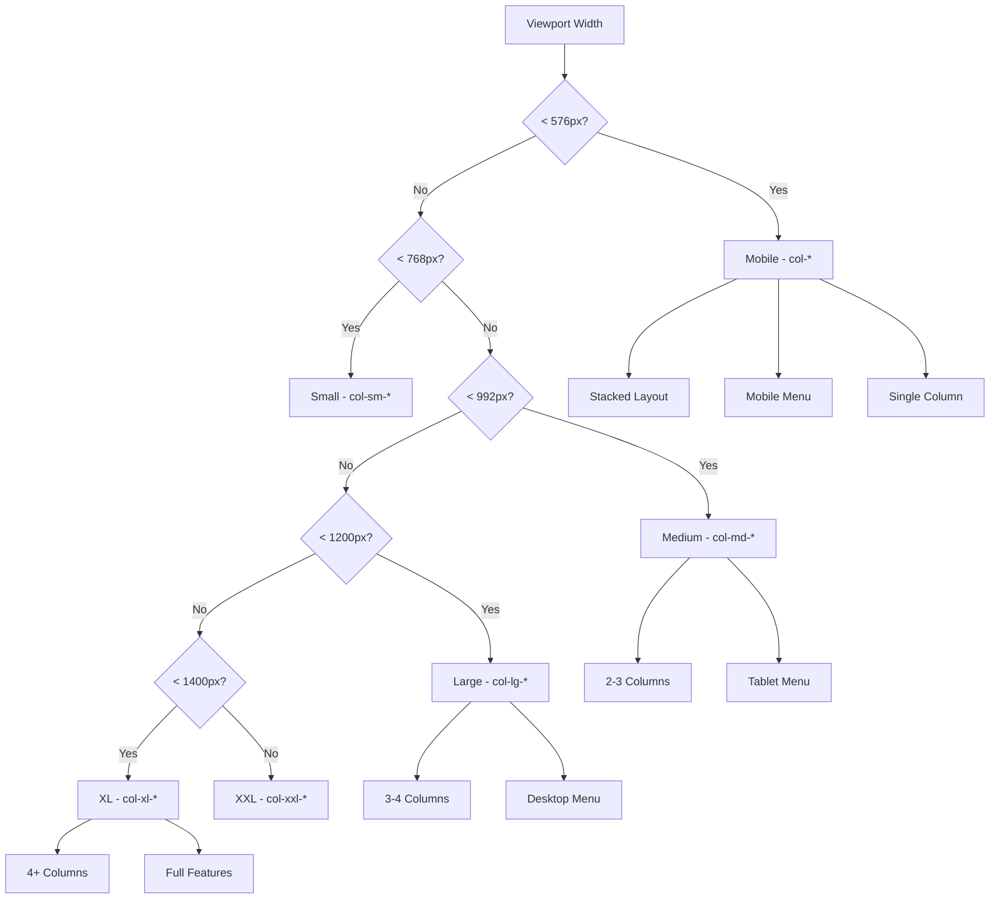
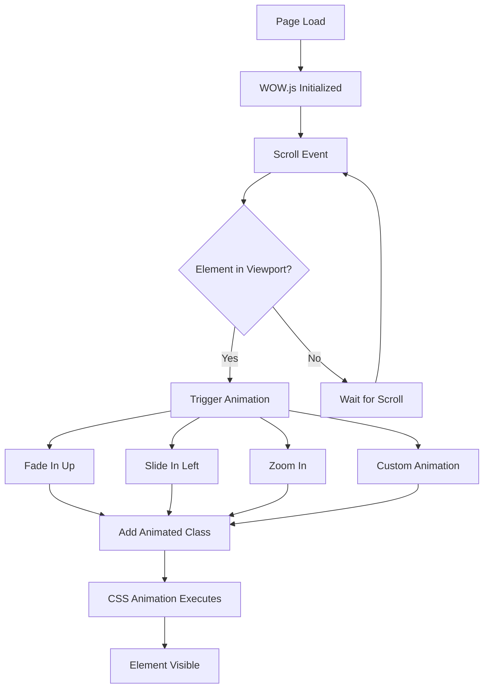
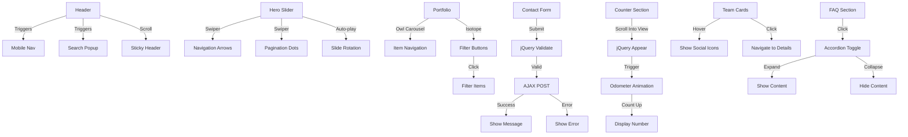
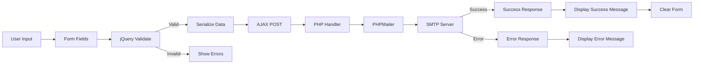
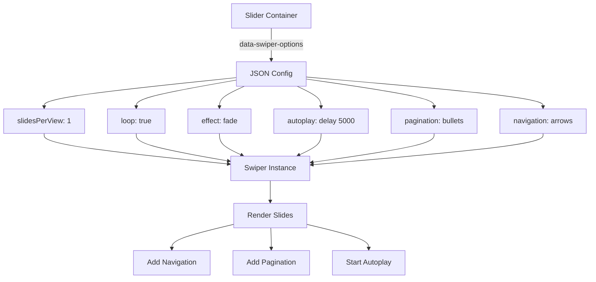
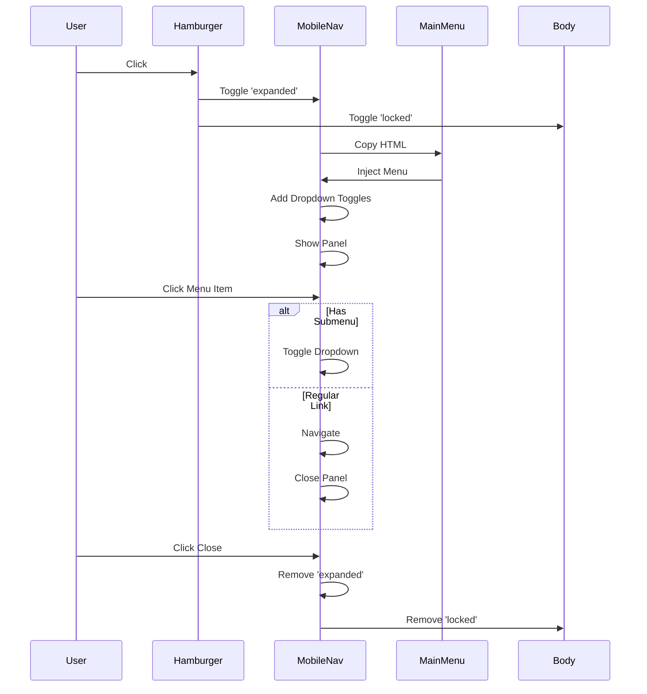

# Meciy Template - Component Architecture Diagram

## Page Structure Flow



## Component Hierarchy



## JavaScript Initialization Flow



## Form Submission Flow



## Responsive Breakpoint System



## Animation Trigger System



## Component Interaction Map



## Data Flow: Form to Email



## Slider Configuration Pattern



## Mobile Navigation Flow



## CSS Class Naming Pattern

```
Component Block:    .component-name
Element:            .component-name__element
Modifier:           .component-name__element--modifier
Variant:            .component-name--variant
State:              .component-name.is-active
Utility:            .text-center, .hidden-lg
```

## Animation Timing System

```
Preloader:          800ms delay + 1000ms fade
WOW Animations:     100ms-400ms delays (staggered)
Swiper Autoplay:    5000ms per slide
Owl Autoplay:       6000ms per slide
Scroll Duration:    1000ms smooth scroll
Form Fade:          10000ms auto-hide messages
```

## Icon System Architecture

```
Font Icons:
├── Meciy Icons (Custom)
│   ├── icon-consulting
│   ├── icon-meditation
│   └── [20+ custom icons]
│
└── Font Awesome
    ├── Brands (fab)
    ├── Solid (fas)
    └── Regular (far)
```

## File Loading Order

```
1. CSS Files (Head)
   ├── Bootstrap
   ├── Vendor CSS
   └── Template CSS

2. HTML Content (Body)
   ├── Preloader
   ├── Sidebar Widget
   ├── Page Wrapper
   │   ├── Header
   │   ├── Main Content
   │   └── Footer
   └── Modals/Overlays

3. JavaScript Files (End of Body)
   ├── jQuery
   ├── Vendor JS
   └── Template JS (meciy.js)
```
